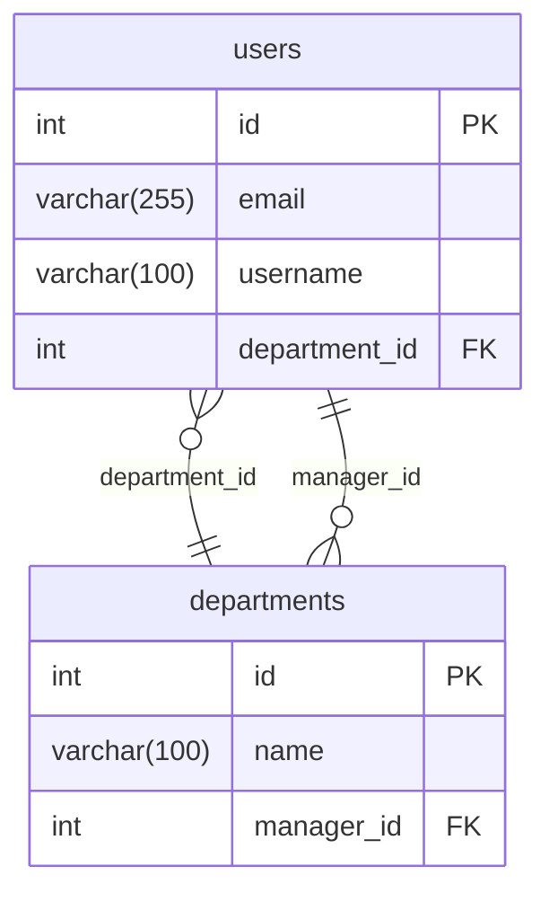

# Schema Diff & Mermaid Export — Design Spec

**Date:** 2026-04-16
**Scope:** Phase 2 Round 1 — two independent features shipped together

## Overview

1. **Mermaid ER Diagram Export** — Generate a Mermaid `erDiagram` block from the loaded schema, downloadable as `.mermaid.md` or copyable to clipboard. Added to the Export/Share dropdown on all view pages.

2. **Schema Diff / Comparison** — A new dedicated page (`dynamic-diff.html`) that compares two schemas side-by-side, showing added/removed/modified tables, columns, FKs, and indexes.

---

## Feature 1: Mermaid ER Diagram Export

### Trigger

New option "Download Mermaid" in the Export/Share dropdown on all 4 view pages (list, visual, analysis, diff).

### Output Format

A `.mermaid.md` file containing a fenced Mermaid code block:

````

````

### Generation Rules

- Each table becomes an entity block with columns listing: type, name, and PK/FK markers
- Column types are simplified for readability: `varchar(255)` stays as-is, `int(11)` becomes `int`
- PK columns get the `PK` marker, FK columns get `FK`
- FK relationships rendered as Mermaid relationship lines:
  - One-to-many (default): `}o--||` (many-to-one from FK table to referenced table)
  - The label is the FK column name: `: "column_name"`
- Tables grouped by auto-categorization as Mermaid comments (`%% Category: Name`)
- Tables are sorted alphabetically within each category

### Clipboard Option

In addition to the file download, a "Copy Mermaid" button in the Export dropdown copies the raw Mermaid text (without the markdown fencing) to the clipboard with a toast confirmation.

### Download Details

- Filename: `schema-{dbName}-{date}.mermaid.md`
- MIME type: `text/markdown`
- Generation: client-side, same Blob download pattern as other exports

### Function

`downloadMermaid()` — added to all 4 view pages. Uses `autoCategorize(schema)` where available (list, visual, diff), falls back to alphabetical sorting (analysis).

`copyMermaid()` — copies raw Mermaid text to clipboard, shows toast.

### Files Changed

- `public/dynamic-list.html` — add Mermaid + Copy Mermaid to Export dropdown, add `downloadMermaid()` and `copyMermaid()`
- `public/dynamic-visual.html` — same
- `public/dynamic-analysis.html` — same (alphabetical version without `autoCategorize`)
- `public/dynamic-diff.html` — include in Export dropdown (new file, see Feature 2)

---

## Feature 2: Schema Diff / Comparison

### New Page

`public/dynamic-diff.html` — a dedicated comparison page.

### Entry Points

1. **Index page** (`index.html`): A "Compare Schemas" button below the existing connection form. Navigates to `/dynamic-diff.html`.
2. **Nav bar**: A "Diff" tab added to all view pages. Shown dimmed (`opacity: 0.5`) by default. Becomes fully visible when a diff has been run (detected by checking `sessionStorage.getItem('dbdiagram_diff_a')`).

### Page Layout

**Top section — Source selectors:** Two side-by-side panels ("Schema A" and "Schema B"), each with a source selector dropdown:

- **Current Schema** — uses the schema already loaded in `sessionStorage.getItem('dbdiagram_data')`. Disabled/hidden if no schema is loaded.
- **Live Connection** — inline form fields: dbType selector, host, port, user, password, database. Submits to `/api/schema`.
- **SQL Paste / File** — textarea for pasting SQL + file drop zone for `.sql` files. Submits to `/api/schema-from-sql`.

Each panel shows a confirmation badge once a schema is loaded (e.g., "mydb — 35 tables").

**Compare button** — centered between the two panels. Enabled only when both schemas are loaded.

**Bottom section — Diff results:** Displayed after comparison. Three collapsible sections:

#### Added Tables (in B but not A)
- Green-tinted cards
- Each card shows the full table: columns, PKs, FKs, indexes
- Styled similarly to the list view table cards

#### Removed Tables (in A but not B)
- Red-tinted cards
- Same detail level as added tables

#### Modified Tables (exist in both, but differ)
- Yellow-tinted cards
- Each card shows a change summary:
  - **Added columns**: green rows with column details
  - **Removed columns**: red rows with column details
  - **Changed columns**: yellow rows showing old → new (type change, nullable change, auto_increment change)
  - **Added FKs**: green FK entries
  - **Removed FKs**: red FK entries
  - **Added indexes**: green index entries
  - **Removed indexes**: red index entries

#### Unchanged Tables
- Not shown by default (too noisy)
- A "Show N unchanged tables" toggle at the bottom to expand if needed

### Summary Stats Bar

Displayed above the diff results:

```
Schema A: mydb_staging (32 tables) → Schema B: mydb_production (35 tables)
+3 added | -0 removed | 5 modified | 27 unchanged
```

### Diff Algorithm

Client-side JavaScript. No external libraries.

1. **Table matching:** Compare table names (case-insensitive). Tables in B but not A → added. Tables in A but not B → removed. Tables in both → check for modifications.

2. **Column comparison** (for matched tables): Compare by column name.
   - Column in B but not A → added column
   - Column in A but not B → removed column
   - Column in both → compare `type`, `nullable`, `auto_increment`. Any difference → changed column.

3. **FK comparison** (for matched tables): Compare by FK name, or if names differ, by (columns + ref_table + ref_columns) tuple.
   - FK in B but not A → added FK
   - FK in A but not B → removed FK

4. **Index comparison** (for matched tables): Compare by index name, or by columns tuple.
   - Index in B but not A → added index
   - Index in A but not B → removed index

5. **PK comparison** (for matched tables): Compare primary_keys arrays. If they differ → flag as PK change (shown as a special row in the modified card).

### Diff Export

The Export/Share dropdown on the diff page includes:

- **Share Link** — compresses both schemas into the URL hash (format: `#diff=gz:{a_data}|{b_data}`)
- **Download Markdown** — generates a diff report in GFM with added/removed/modified sections using `+`/`-` notation
- **Download Mermaid** — generates Mermaid for Schema B (the "target" schema)

### Storage

- `sessionStorage.setItem('dbdiagram_diff_a', JSON.stringify(schemaA))` — Schema A data
- `sessionStorage.setItem('dbdiagram_diff_b', JSON.stringify(schemaB))` — Schema B data
- Cleared when starting a new comparison (replaced with new data). Persisted across page navigations so the Diff tab state is preserved during the session

### Styling

- Matches the existing dark theme (`#0f172a` body, `#1e293b` cards, `#334155` borders)
- Global nav bar at the top (same as other pages), with "Diff" tab active
- Source selector panels: side-by-side flexbox, each in a `#1e293b` card
- Diff result cards use tinted borders/backgrounds:
  - Added: `border-color: #22c55e; background: rgba(34, 197, 94, 0.05)`
  - Removed: `border-color: #ef4444; background: rgba(239, 68, 68, 0.05)`
  - Modified: `border-color: #eab308; background: rgba(234, 179, 8, 0.05)`

---

## Nav Bar Updates

### All 4 view pages (list, visual, analysis, diff)

Add a "Diff" tab to `.nav-center`:

```html
<a href="/dynamic-diff.html" class="nav-tab diff-tab" id="diffTab">Diff</a>
```

**Dimmed by default:** CSS rule `.diff-tab { opacity: 0.4; }`. On page load, JS checks `sessionStorage.getItem('dbdiagram_diff_a')` — if present, removes the dimmed state: `diffTab.style.opacity = '1'`.

**Active state on diff page:** The diff page sets `class="nav-tab active"` on its own Diff tab.

### Index page

Add a "Compare Schemas" link below the connection form:

```html
<a href="/dynamic-diff.html" class="compare-link">Compare Two Schemas →</a>
```

Styled as a secondary link, not competing with the main connection form.

### Export dropdown updates (all pages)

Add after the existing Markdown option:

```html
<button onclick="downloadMermaid()"><span class="icon">🧜</span> Download Mermaid</button>
<button onclick="copyMermaid()"><span class="icon">📋</span> Copy Mermaid</button>
```

---

## File Changes

| File | Changes |
|------|---------|
| `public/dynamic-diff.html` | **New file** — full diff comparison page with source selectors, diff engine, results display, nav bar, export dropdown |
| `public/index.html` | Add "Compare Schemas" link |
| `public/dynamic-list.html` | Add Diff tab to nav, add Mermaid + Copy Mermaid to Export dropdown, add `downloadMermaid()` and `copyMermaid()` functions |
| `public/dynamic-visual.html` | Add Diff tab to nav, add Mermaid + Copy Mermaid to Export dropdown, add `downloadMermaid()` and `copyMermaid()` functions |
| `public/dynamic-analysis.html` | Add Diff tab to nav, add Mermaid + Copy Mermaid to Export dropdown, add `downloadMermaid()` and `copyMermaid()` functions (alphabetical, no autoCategorize) |
| `server.js` | No changes |
| `README.md` | Add Schema Diff and Mermaid Export to features list |
